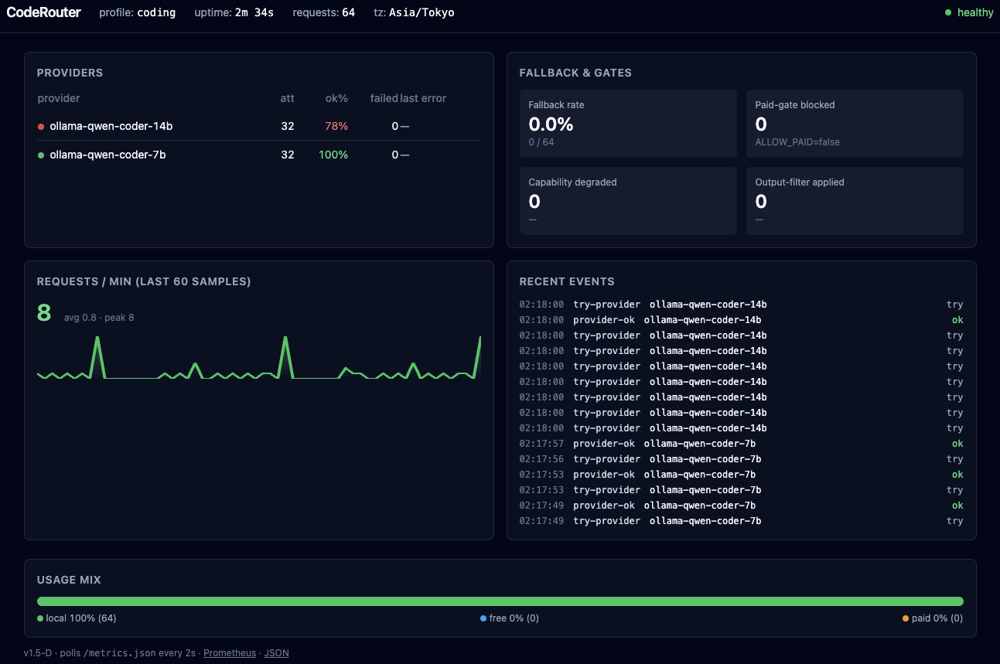

<h1 align="center">CodeRouter</h1>

<p align="center">
  <strong>The router that fixes the "tool calling breaks on local LLMs"<br>problem Claude Code users keep hitting.</strong>
</p>

<p align="center">
  Small quantized models (qwen2.5-coder:7B, phi-4, mistral-nemo, etc.) often<br>
  emit <strong>malformed <code>{"name":..., "arguments":...}</code> as plain text</strong>.<br>
  CodeRouter's <strong>tool-call repair pass</strong> recovers them into valid
  <code>tool_use</code> blocks<br>
  before they reach Claude Code.
</p>

<p align="center">
  <strong>For everyone who gave up on local models because "agentic coding just didn't work".</strong><br>
  Now you can actually run a local-first agent that holds together.
</p>

<p align="center">
  <a href="https://github.com/zephel01/CodeRouter/actions/workflows/ci.yml"></a>
  <a href=""></a>
  <a href=""></a>
  <a href=""></a>
  <a href=""></a>
  <a href=""></a>
</p>

<p align="center">
  <strong>English</strong> · <a href="./README.md">日本語</a> · <a href="./docs/usage-guide.en.md">Usage guide</a> · <a href="./docs/security.en.md">Security</a>
</p>

<p align="center">
  <strong>Up in 10 min →</strong> <a href="./docs/quickstart.en.md">Quickstart</a>
  ｜ <strong>Deep dive →</strong> <a href="./docs/usage-guide.en.md">Usage guide</a>
  ｜ <strong>Run for free →</strong> <a href="./docs/free-tier-guide.en.md">Free-tier guide</a>
  ｜ <strong>Do I need it? →</strong> <a href="./docs/when-do-i-need-coderouter.en.md">Decision guide</a>
</p>

<!-- TODO: before/after GIF will live at docs/assets/before-after-toolcall.gif. -->
<!--  -->

**What else CodeRouter does for you**

- `coderouter doctor --check-model <provider>` runs live probes against the provider and tells you whether it actually supports tool_calls / streaming / thinking — with a copy-paste YAML patch when declarations and behavior disagree
- Scrubs reasoning leaks (`<think>...</think>` tags and six variants of `<|turn|>` / `<|eot_id|>` / `<|im_end|>` stop markers) across SSE chunk boundaries
- Automatic fallback from local → free cloud (OpenRouter free / NVIDIA NIM 40 req/min free tier) → paid APIs, with `ALLOW_PAID=false` as the default so billing is opt-in
- Five runtime dependencies (`fastapi` / `uvicorn` / `httpx` / `pydantic` / `pyyaml`) — pure Python, MIT, 710 tests green

→ **Claude Code / gemini-cli / codex on top of Ollama / llama.cpp / NVIDIA NIM, without the agent falling apart.**

## Documentation

| Goal | Doc | What's inside |
|---|---|---|
| **Get it running** | [Quickstart](./docs/quickstart.en.md) | Claude Code / codex on top of local Ollama in 10–15 minutes |
| **Use it well** | [Usage guide](./docs/usage-guide.en.md) | Hardware-tier model picks, tuning defaults, per-OS launch flow, reading `doctor` / `verify` output |
| **Run for free** | [Free-tier guide](./docs/free-tier-guide.en.md) | Stacking NVIDIA NIM (40 req/min) with OpenRouter free: live-verified roster and five footguns |
| **Decide if you need it** | [Decision guide](./docs/when-do-i-need-coderouter.en.md) | Agent × model matrix to figure out whether CodeRouter fits your setup at all |
| **When stuck** | [Troubleshooting](./docs/troubleshooting.en.md) | How to use `doctor`, why `.env` needs `export`, the 5 Ollama silent-fail symptoms, Claude Code integration gotchas |
| **llama.cpp direct** | [llama.cpp direct guide](./docs/llamacpp-direct.en.md) | Rescue path for Qwen3.6 (Ollama is brittle). 7-step recipe: `llama.cpp` build → Unsloth GGUF → `llama-server` → CodeRouter wiring. Real-machine verified in v1.8.3. |
| **Operate safely** | [Security](./docs/security.en.md) | Threat model, secret handling, vulnerability reporting |
| **History** | [CHANGELOG](./CHANGELOG.md) | All releases (latest: v1.8.3 — tool_calls probe also thinking-aware + adapter strips `reasoning_content` / llama.cpp direct backend supported) |
| **Track the design** | [plan.md](./plan.md) | Design invariants, milestones, roadmap |

日本語版: [Quickstart](./docs/quickstart.md) · [利用ガイド](./docs/usage-guide.md) · [無料枠ガイド](./docs/free-tier-guide.md) · [要否判定](./docs/when-do-i-need-coderouter.md) · [トラブルシューティング](./docs/troubleshooting.md) · [Security](./docs/security.md)

## What gets easier with CodeRouter

CodeRouter is a small router that sits between your coding agent (Claude Code / gemini-cli / codex / plain OpenAI SDK) and the LLMs behind it. Point your tool at one endpoint and CodeRouter picks the provider — starting with your local Ollama / llama.cpp, falling back to free cloud (OpenRouter free), and only touching paid APIs when you explicitly opt in.

Concretely, it takes care of things most beginners hit the hard way:

- **Keep running Claude Code even with no API key and no Anthropic subscription.** Your local model (or OpenRouter's free tier) answers. Paid providers only get called if you set `ALLOW_PAID=true`.
- **Don't lose the reply mid-stream.** When one provider dies mid-answer you get one clean error — not a Frankenstein reply spliced from two models.
- **No surprise bill.** `ALLOW_PAID=false` is the default; when CodeRouter drops a paid provider from the chain it logs one clear line so you can see why.
- **Use Claude Code / gemini-cli / codex on top of local Ollama.** Claude Code speaks Anthropic wire format, Ollama / llama.cpp / LM Studio speak OpenAI. CodeRouter translates both directions, and repairs the malformed `{"name":..., "arguments":...}` JSON that small local models emit as plain text.
- **Know *why* your local model is acting weird.** `coderouter doctor --check-model <provider>` probes six common failure modes (context truncation, streaming cutoff, missing tool-use, reasoning leaks, auth, Anthropic `thinking`) and prints a copy-paste YAML patch.
- **Auditable.** 5 runtime dependencies (vs. 100+ for LiteLLM). Pure Python, MIT, 710 tests passing.

```
Client (Claude Code / OpenAI SDK / gemini-cli / codex / curl)
        │
        ▼
  CodeRouter  ──►  ① local model (Ollama / llama.cpp — free, top priority)
                   ② free cloud (OpenRouter qwen3-coder:free, gpt-oss-120b:free, …)
                   ③ paid cloud (Claude / GPT — only if ALLOW_PAID=true)
```

### Live dashboard

`coderouter dashboard` answers the questions you actually ask mid-incident, without grepping logs:

- Which providers are alive right now, and which one is currently answering?
- Has a fallback fired recently, and why?
- Is the paid gate still closed (i.e. am I still on the free path)?
- What's the request volume over the last few minutes?
- What just happened — the last N events, in order?



The snapshot above was taken while `scripts/demo_traffic.sh` drove mixed traffic (normal / stream / burst / fallback / paid-gate) against a local mock. Panels left-to-right, top-to-bottom: provider status, fallback & gate state, requests/min sparkline, recent events (most recent on top), and usage mix.

## Do you need CodeRouter?

CodeRouter is a wire-translation + band-aid layer. If your agent already speaks OpenAI and your model behaves well, you probably don't need it. The two tables below are the short version; the full decision guide is in [`docs/when-do-i-need-coderouter.en.md`](./docs/when-do-i-need-coderouter.en.md).

**By agent** — what can reach Ollama directly:

| Agent | Wire | Direct-to-Ollama | Need CodeRouter? |
|---|---|---|---|
| Claude Code | Anthropic | No | **Yes** — wire translation |
| Codex CLI / plain OpenAI SDK | OpenAI | Yes, via `OPENAI_BASE_URL` | Optional |
| gemini-cli | Gemini | No | Yes (adapter) |
| GitHub Copilot CLI | GitHub-proprietary | **No (locked backend)** | N/A — can't be redirected |

**By model** — what misbehaves on direct path:

| Model | Clean output? | CodeRouter filter that helps |
|---|---|---|
| `llama3.1` / `mistral-nemo` / `phi-4` / `qwen2.5` (non-coder) | Yes | — |
| `qwen2.5-coder` | No — leaks `<think>` | `strip_thinking` |
| `gpt-oss` / `deepseek-r1` / `qwq` | No — reasoning leaks | `strip_thinking` |
| Small quants (Q2 / Q3) or Modelfiles with wrong template | Often no — bad tool JSON or stop markers | `repair_tool_call` / `strip_stop_markers` |

If you're on an OpenAI-compatible agent with a well-behaved model and don't need fallback, `OPENAI_BASE_URL=http://localhost:11434/v1` is the simpler answer. Anything else — especially Claude Code, reasoning models, or multi-tier fallback with mid-stream safety — is where CodeRouter is doing real work.

## Why not just use X directly?

- **Ollama / llama.cpp / LM Studio directly.** Fast and free, but Claude Code (and most agents targeting `/v1/messages`) speak Anthropic wire format — these servers only speak OpenAI chat. You either hit "unsupported endpoint" or tool-use silently breaks because the model emits tool JSON as plain text. CodeRouter translates both directions and repairs the JSON before your agent sees it.
- **LiteLLM.** Excellent project, but heavy — 100+ transitive dependencies — and doesn't natively expose `/v1/messages` for Claude Code.
- **OpenRouter alone.** Free tier is rate-limited and occasionally down; paid-only is unfriendly to newcomers and to CI pipelines.

Design invariants and the roadmap are in [`plan.md`](./plan.md). Beginner-friendly articles on *why the same local model sometimes works and sometimes doesn't* are published separately on Zenn / Note.

## Quickstart (2 commands)

**v1.7.0 published to PyPI**, **v1.8.0 added use-case-aware 4 profiles + Z.AI/GLM integration**, **v1.8.2 made the `doctor` probe thinking-model-aware**. `uvx` installs and runs in one shot (Python 3.12+ required):

```bash
# 1. Drop a sample config
mkdir -p ~/.coderouter
curl -fsSL https://raw.githubusercontent.com/zephel01/CodeRouter/main/examples/providers.yaml \
  > ~/.coderouter/providers.yaml

# 2. Install + run, in one line
uvx coderouter-cli serve --port 8088
```

Want a permanent install?

```bash
uv tool install coderouter-cli
coderouter serve --port 8088
```

Cloning for development?

```bash
git clone https://github.com/zephel01/CodeRouter.git
cd CodeRouter
uv sync
uv run coderouter serve --port 8088
```

> **Note**: the PyPI distribution name is `coderouter-cli`, but the command and Python import name are both `coderouter`. See [CHANGELOG `[v1.7.0]`](./CHANGELOG.md#v170--2026-04-25-pypi-公開-uvx-coderouter-cli-一発で動く) for details.
>
> **For the `--apply` automation** (v1.8.0+): install `ruamel.yaml` as the optional dependency (`pip install 'coderouter-cli[doctor]'` or `uv pip install ruamel.yaml`). Not required for the base feature set.

Then point any OpenAI client at `http://127.0.0.1:8088`:

```bash
curl http://127.0.0.1:8088/v1/chat/completions \
  -H 'Content-Type: application/json' \
  -d '{
    "model": "ignored",
    "messages": [{"role": "user", "content": "Hello"}]
  }'
```

The `model` field is currently a placeholder — routing is decided by the `profile` field (defaults to `default` from `providers.yaml`).

New to CodeRouter? The [usage guide](./docs/usage-guide.en.md) walks through hardware-tier model picks, tuning defaults, per-OS launch flow, and OpenRouter free pairing. (日本語版: [利用ガイド](./docs/usage-guide.md))

**Stacking NVIDIA NIM's free tier (40 req/min) with OpenRouter free** for zero-cost agentic use is covered in the [free-tier guide](./docs/free-tier-guide.en.md) — live-verified model roster, design intent behind the `claude-code-nim` profile, and five common footguns. (日本語版: [無料枠ガイド](./docs/free-tier-guide.md))

**Care about how API keys are managed?** v1.6.3 ships `coderouter serve --env-file` and `coderouter doctor --check-env` for clean integration with 1Password CLI / direnv + sops / OS Keychain — see [troubleshooting §5](./docs/troubleshooting.en.md#5-env-security-in-practice-added-in-v163).

## OS support

CodeRouter is pure Python 3.12+; OS support is effectively `min(coderouter, ollama, claude-code)`.

| OS | Server | Local inference | Notes |
|---|---|---|---|
| macOS — Apple Silicon (M1–M5) | ✅ | ✅ Metal (native) | **Primary dev target** |
| macOS — Intel | ✅ | ⚠️ CPU only | Cloud fallback only is practical |
| Linux — x86_64 (Ubuntu / Debian / Fedora) | ✅ | ✅ CUDA or CPU | Fully supported |
| Linux — ARM64 (Pi 5 / Graviton) | ✅ | ⚠️ CPU on Pi | Usable as a route-to-cloud proxy |
| Windows — WSL2 (Ubuntu) | ✅ | ✅ | **Recommended Windows path** |
| Windows — native | ⚠️ partial | ✅ CUDA | `scripts/verify_*.sh` need bash (Git Bash/WSL2) |

Full matrix with caveats and the "no local GPU" recipe: [usage guide §1](./docs/usage-guide.en.md#1-os-compatibility).

## Status — v1.0 stable (2026-04)

**710 tests pass. 5 runtime dependencies. Works on macOS / Linux / Windows WSL2.** The router is stable for day-to-day Claude Code use; the v1.0 wrap-up is in [`docs/retrospectives/v1.0.md`](./docs/retrospectives/v1.0.md).

What CodeRouter can do for you today:

- **Bridge any client to any provider.** Accept requests from any OpenAI-compatible client **and** from Claude Code (via `/v1/messages`). Route them — streaming or non-streaming — to a local Ollama, OpenRouter free, Anthropic, or any mix of those in a single fallback chain.
- **Fall back safely without leaking partial responses.** If the first provider fails before the first byte, the next one tries. If it fails *after* the first byte, the client sees one clean `event: error` — not a spliced Frankenstein reply.
- **Pay only when you opt in.** `ALLOW_PAID=false` (the default) keeps paid providers out of every chain, and emits one clear log line when it does block.
- **Repair what small local models break.** Qwen/DeepSeek-style models that emit `{"name":..., "arguments":...}` as plain text get lifted back into valid `tool_use` blocks before Claude Code sees them.
- **Tell you what's wrong.** `coderouter doctor --check-model <provider>` runs six probes — auth, context-window truncation, streaming cutoff, tool-call capability, reasoning-field leaks, Anthropic `thinking` support — and prints copy-paste YAML patches when your declarations don't match reality.
- **Scrub reasoning leakage.** `output_filters: [strip_thinking, strip_stop_markers]` on any provider removes `<think>…</think>` blocks and six stop-marker variants from the response stream, stably across SSE chunk boundaries.
- **Preserve Anthropic-native features when the chain reaches Anthropic.** `cache_control`, `thinking`, and `anthropic-beta` header-gated body fields pass through verbatim on `kind: anthropic` providers; lossy translation down to OpenAI shape is logged, not silent.

**Want the per-release detail?** Every v0.x and v1.0-A/B/C slice — what shipped, how many tests it added, why it was needed — is in [CHANGELOG.md](./CHANGELOG.md). Design invariants and the forward roadmap live in [plan.md](./plan.md).

**Coming next** (see [plan.md §10](./plan.md) for v1.0, §18 for v1.0+): v1.5 ✅ metrics / `/dashboard` / `coderouter stats` TUI / `scripts/demo_traffic.sh`. v1.6 ✅ `auto_router` (task-aware routing) + NVIDIA NIM free tier + troubleshooting doc split + `--env-file` / `doctor --check-env`. v1.7 ✅ PyPI publish (`uvx coderouter-cli`). v1.8 ✅ Use-case-aware 4 profiles (multi/coding/general/reasoning) + Gemma 4 / Qwen3.6 / Z.AI (GLM) registration + `setup.sh` wizard + `coderouter doctor --check-model --apply` (non-destructive YAML write-back) + `claude_code_suitability` startup check + Trusted Publishing automation. Remaining for v1.9+: `coderouter doctor --network` (CI), launcher scripts, opt-in update check.

### Use it with Claude Code

```bash
# Terminal 1: start CodeRouter with a Claude Code-tuned profile
uv run coderouter serve --port 8088

# Terminal 2: point Claude Code at it, selecting the tuned profile via header
ANTHROPIC_BASE_URL=http://localhost:8088 \
ANTHROPIC_AUTH_TOKEN=dummy \
claude
```

To use the `claude-code` profile from `examples/providers.yaml` (7b first, 14b as quality fallback, 14b timeout bumped to 300s), set it as the default in your config:

```yaml
# ~/.coderouter/providers.yaml
default_profile: claude-code
```

Or pick the profile at server-launch time with the `--mode` flag (v0.6-A):

```bash
uv run coderouter serve --port 8088 --mode claude-code
# equivalent to: CODEROUTER_MODE=claude-code uv run coderouter serve --port 8088
```

`--mode` overrides the YAML `default_profile` for this process only. Per-request overrides (`X-CodeRouter-Profile` header, or `profile` field in the body) still win, so `--mode` is the right knob when you want to try a different chain without editing the config file. Unknown profile names fail fast at startup rather than on the first request.

The profile itself looks like this in `examples/providers.yaml` — copy it verbatim, then edit the `base_url` / `model` of each `providers:` entry to match your local stack:

```yaml
# Tuned for ANTHROPIC_BASE_URL=http://localhost:8088 claude.
# Claude Code declares all its tools (Bash/Glob/Read/Write/...) every turn,
# so the router always uses the v0.3-D tool-downgrade path; user-felt latency
# ≈ upstream total response time. Put the fastest tool-capable model first,
# 14b second as a quality fallback, 2 free clouds for rate-limit escape,
# and Claude as paid last resort.
profiles:
  - name: claude-code
    providers:
      - ollama-qwen-coder-7b         # ~30–60s/turn on M-series, tool-capable
      - ollama-qwen-coder-14b        # quality fallback (timeout_s: 300)
      - openrouter-free              # qwen/qwen3-coder:free (262K context)
      - openrouter-gpt-oss-free      # openai/gpt-oss-120b:free (different vendor = rate-limit escape)
      - openrouter-claude            # paid, requires ALLOW_PAID=true
```

If you'd rather have the paid tier go through Anthropic's native API (so `cache_control` / `thinking` blocks survive when reached via the Anthropic ingress), swap `openrouter-claude` for `anthropic-direct` — the `claude-code-direct` profile in `examples/providers.yaml` does exactly that.

#### Profile-level parameter overrides (v0.6-B)

A profile can override two per-call provider parameters for every attempt in its chain — handy when the same provider list should behave differently under different profiles (e.g. a long-context `/no_think` mode vs. a short chat mode):

```yaml
profiles:
  - name: claude-code-long
    timeout_s: 600             # replaces ProviderConfig.timeout_s for this profile
    append_system_prompt: ""   # empty string = explicitly clear the provider's directive
    providers:
      - ollama-qwen-coder-14b
      - openrouter-free
```

Semantics: the profile value **replaces** the provider's value when set (not appended), keeping parity with how scalar fields like `timeout_s` naturally behave. `append_system_prompt: ""` explicitly clears the provider directive for this profile (distinguished from "unset", which means "fall back to the provider's default"). Unset fields leave every provider's defaults intact. `retry_max` is deferred to a later minor since adapter-level retry is still unpiloted — the fallback chain itself is currently the retry mechanism.

#### Mode aliases — `X-CodeRouter-Mode` (v0.6-D)

Clients that want to express **intent** rather than a concrete profile name can send an `X-CodeRouter-Mode` header, and CodeRouter resolves it against a YAML `mode_aliases:` block:

```yaml
# providers.yaml
mode_aliases:
  coding: claude-code          # client sends Mode: coding → profile claude-code
  long:   claude-code-long
  fast:   ollama-only
```

```bash
curl http://localhost:8088/v1/chat/completions \
  -H 'Content-Type: application/json' \
  -H 'X-CodeRouter-Mode: coding' \
  -d '{ "messages": [{"role":"user","content":"hi"}] }'
```

Precedence (first hit wins): body `profile` > `X-CodeRouter-Profile` header > `X-CodeRouter-Mode` header > `default_profile`. Mode sits below Profile because **Profile is the implementation, Mode is the intent** — when a caller specifies the concrete profile, respect it verbatim. This matters when a proxy in front of CodeRouter auto-injects a Mode header: an explicit body/header `profile` from the caller still wins.

Guardrails: broken alias targets fast-fail at startup (same philosophy as `default_profile` validation), unknown Mode values return 400 with the list of declared aliases, and every resolution logs a `mode-alias-resolved` INFO line so operators can grep the mapping after the fact.

#### Model capabilities registry — `model-capabilities.yaml` (v0.7-A)

The "which Anthropic families accept `thinking: {type: enabled}`" knowledge used to live as a regex literal inside `coderouter/routing/capability.py`. From v0.7-A it lives in `coderouter/data/model-capabilities.yaml` (shipped with the package) with an optional override at `~/.coderouter/model-capabilities.yaml`. Adding a new family when Anthropic releases one is a one-line YAML edit — no code change, no release cycle.

```yaml
# ~/.coderouter/model-capabilities.yaml — optional user override
version: 1
rules:
  # A hypothetical new family Anthropic just shipped; you want to use
  # it before the CodeRouter bundled defaults are updated.
  - match: "claude-sonnet-5-*"
    kind: anthropic
    capabilities:
      thinking: true

  # Your local Ollama reliably calls tools on this tag — declare it so
  # the doctor probe (v0.7-B) agrees and future glob consumers can
  # see it as an opinionated default.
  - match: "qwen3-coder:*"
    kind: openai_compat
    capabilities:
      tools: true
```

Schema: each rule has `match` (fnmatch glob against `provider.model`, case-sensitive), optional `kind` filter (`"anthropic"` / `"openai_compat"` / `"any"`, default `"any"`), and a `capabilities:` map that can declare `thinking` / `reasoning_passthrough` / `tools` / `max_context_tokens`. Rules are walked top-to-bottom and the **first rule that declares each flag** wins for that flag — a rule can override one capability while leaving others to fall through.

Precedence across the layers is `providers.yaml` `capabilities.*` per-provider (explicit opt-in) > user `model-capabilities.yaml` > bundled `model-capabilities.yaml` > unset (treated as False). This means a user never loses the ability to override — an explicit `capabilities.thinking: true` on a provider in `providers.yaml` still wins over the registry, same as v0.5-A.

Typos are caught at load time: unknown top-level fields, unknown flag names, and invalid `kind` values raise `ValidationError` before the server accepts traffic. The same fast-fail stance as `default_profile` / `mode_aliases` validation.

#### Doctor — `coderouter doctor --check-model <provider>` (v0.7-B)

"I set up Ollama and pointed the router at it, but something's off" is the most common onboarding failure. The v0.7-B `doctor` subcommand makes that a one-liner to diagnose:

```bash
coderouter doctor --check-model ollama-qwen-coder-14b
```

It runs four small probes (≤100 tokens each) against that one provider — **not** the whole fallback chain — and prints a verdict table plus copy-paste YAML patches if the observed behavior doesn't match what `providers.yaml` + `model-capabilities.yaml` currently declare:

```
provider: ollama-qwen-coder-14b  (kind=openai_compat, model=qwen2.5-coder:14b)

probe                     verdict        detail
auth+basic-chat           OK             200 in 1.4s, 18 tokens in / 6 tokens out
tool_calls                NEEDS_TUNING   model emitted a tool_use block but registry says tools=false
thinking                  N/A            kind=openai_compat; thinking probe is anthropic-only
reasoning-leak            OK             no stray `reasoning` field on choice.message

suggested patch for ~/.coderouter/providers.yaml:
  providers:
    - name: ollama-qwen-coder-14b
      capabilities:
        tools: true        # observed: model returned a well-formed tool_use block
```

The four probes and why they exist:

- **auth+basic-chat** — one trivial turn. Catches the "API key not set" / "wrong base_url" / "provider unreachable" class of failures up front. If this probe fails, the remaining three are marked `SKIP` so you don't waste time (or tokens) chasing symptoms.
- **tool_calls** — sends a fake `echo(text: string)` tool spec and a prompt that should trigger it. Non-destructive on purpose — no real side effects upstream. Verdict is `NEEDS_TUNING` when the model emits a valid `tool_use` but the registry says `tools: false` (or vice versa).
- **thinking** — Anthropic-only; sends `thinking: {type: enabled, budget_tokens: 16}` natively (bypassing the OpenAI-shape adapter) and checks whether the upstream accepts the field. Emits a registry patch (not a `providers.yaml` patch) when the family isn't yet in `model-capabilities.yaml`.
- **reasoning-leak** — issues a chat turn and inspects the raw upstream body **before** the v0.5-C strip runs, so it can distinguish "model returns `reasoning`" from "adapter already scrubbed it". Relevant to OpenRouter free models like `openai/gpt-oss-120b:free`.

Exit codes (designed to drop into CI):

| Code | Meaning |
|------|---------|
| `0`  | All probes match declared capabilities; nothing to patch |
| `2`  | At least one `NEEDS_TUNING` verdict; YAML patches are in the output |
| `1`  | A probe couldn't run — auth failed, provider unreachable, or unknown provider name. Fix the precondition and re-run |

Precedence when multiple signals fire: `1` (blocker) > `2` (tuning) > `0` (clean). That matches the Unix lint convention where `2` means "auto-fixable" and `1` means "give up". One probe failure doesn't suppress the others — each verdict line is emitted for transparency, even under auth short-circuit where the skipped probes are shown with `SKIP: upstream auth failed`.

The subcommand targets **one** provider per invocation by design: a doctor probe shouldn't suggest registry-glob changes that affect other providers sharing the same family. Re-run with a different `--check-model` name for each provider in your chain.

#### What to expect

- **First byte latency**: Claude Code declares all its tools (Bash/Glob/Read/Write/…) every turn, so CodeRouter always uses the v0.3-D tool-downgrade path (internal non-streaming + SSE replay). User-felt latency ≈ upstream total response time.
- **On M-series macOS**, qwen2.5-coder:7b returns in ~30–60s per turn, 14b in ~2 min. That's dominated by prompt prefill of the 15–20K-token system prompt Claude Code sends every turn — **not** a CodeRouter overhead.
- **Tool selection quality** is a model limitation, not a wire issue. CodeRouter repairs the wire (text JSON → `tool_use` block); whether the model chose the *right* tool is on the model. qwen2.5-coder:14b sometimes picks `Glob` where `Bash` would be correct — the remedy is a stronger local model or falling through to Claude via `ALLOW_PAID=true`.
- **Mid-stream failure** (Ollama dies after first chunk) surfaces as a single `event: error` to the client, no retry — the partial response is preserved and the stream closes cleanly.

Coming next (see [plan.md §10](./plan.md) for v1.0, §18 for v1.0+):

- v1.0 ✅ — 14-case regression suite, Code Mode (slim Claude Code harness); output cleaning shipped in **v1.0-A** (`output_filters` chain, done)
- v1.5 ✅ — **Metrics dashboard (shipped)** — `MetricsCollector` + `GET /metrics.json` + `GET /metrics` (Prometheus) + `GET /dashboard` (HTML one-pager) + `coderouter stats` curses TUI + `scripts/demo_traffic.sh` traffic generator + `display_timezone` config
- v1.6 ✅ — `auto_router` (task-aware routing; `default_profile: auto` dispatches by image attachment / code-fence ratio / else) + NVIDIA NIM free-tier 8-step chain + doc language swap (JA primary) + troubleshooting page split + `--env-file` / `doctor --check-env`
- v1.7 ✅ — PyPI publish (`uvx coderouter-cli` one-line bootstrap) + Trusted Publishing path (release.yml auto-publish on tag push)
- v1.8 ✅ — **Use-case-aware 4 profiles + GLM/Gemma 4/Qwen3.6 official tags + apply automation**: `multi` (default) / `coding` / `general` / `reasoning` profiles + `append_system_prompt` per profile to nudge non-Claude models toward Claude-style replies + `mode_aliases` (default/fast/vision/think/cheap), Ollama-official `gemma4:e4b/26b/31b` and `qwen3.6:27b/35b` promoted to active stanzas, Z.AI provided as OpenAI-compat with two base URLs (Coding Plan / General API), `coderouter doctor --check-model --apply` writes YAML patches non-destructively (`ruamel.yaml` round-trip preserves comments + key order; idempotent), `setup.sh` onboarding wizard, `claude_code_suitability` startup check (Llama-3.3-70B in `claude-code-*` profiles emits a structured WARN). Remaining for v1.9+: `coderouter doctor --network` (CI-friendly), launcher scripts (`.command` / `.sh` / `.bat`), opt-in startup update check

## Choosing `kind: openai_compat` vs `kind: anthropic`

Every provider in `providers.yaml` has a `kind`. You have two options. The choice affects which wire-level features survive the hop and which clients can reach it.

| Dimension | `kind: openai_compat` | `kind: anthropic` |
|---|---|---|
| Reachable from `/v1/chat/completions` | ✅ native — no translation | ✅ via v0.4-A reverse translation |
| Reachable from `/v1/messages` | ✅ via translation + tool-call repair | ✅ native passthrough |
| Targets | llama.cpp, Ollama, OpenRouter, LM Studio, Together, Groq, ... | `api.anthropic.com`, Bedrock's Anthropic shim, any server speaking the Messages wire |
| `cache_control` blocks | ❌ lost (no OpenAI equivalent) | ✅ preserved end-to-end when reached via `/v1/messages` |
| `thinking` blocks | ❌ lost | ✅ preserved when reached via `/v1/messages` |
| Structured `tool_use` SSE events | synthesized from repair (v0.3-D downgrade) | passthrough from upstream |
| Tool-call repair (plain-text JSON → `tool_use`) | ✅ needed for local models that emit broken JSON | n/a (Anthropic never emits broken JSON) |
| `anthropic-beta` header forwarding (v0.4-D) | n/a | ✅ verbatim |

**Rules of thumb:**

- **Local model or OpenRouter free tier** → `kind: openai_compat`. The reverse path exists, but there's no reason to pay translation cost for providers that speak OpenAI wire natively.
- **Claude via the official API, and you want `cache_control` / `thinking` to work** → `kind: anthropic`, reached via `/v1/messages` (i.e. `ANTHROPIC_BASE_URL=http://localhost:8088` from Claude Code). The `claude-code-direct` profile in `examples/providers.yaml` is pre-wired for this case.
- **Claude reached from an OpenAI client** (`openai` SDK / curl against `/v1/chat/completions`) → `kind: anthropic` still works — basic chat / tools / vision survive the v0.4-A reverse path. But `cache_control` / `thinking` cannot be sent because OpenAI has no equivalent shape.
- **Mixed chain** (local first, Claude as paid last resort) → list both kinds in the same profile. The engine's polymorphic dispatch handles the hop at each provider boundary.

## Troubleshooting

> **Full reference: [`docs/troubleshooting.en.md`](./docs/troubleshooting.en.md) (split out in v1.6.2)**.
> This section is the 30-second cheat sheet.

**First move**: run **[`coderouter doctor --check-model <provider>`](#doctor--coderouter-doctor---check-model-provider-v07-b)** against the failing provider. It runs 6 probes and prints copy-paste YAML patches for any declaration mismatch.

**Symptom-to-section index** (full content is on the linked doc):

- Server starts but upstream returns 401 `Header of type authorization was missing` → [§1 Startup / config gotchas](./docs/troubleshooting.en.md#1-five-startup--config-gotchas-added-in-v162) (`.env` requires `export`, the right way to call `coderouter serve --mode <profile>`)
- Logs show `provider-failed` / `capability-degraded` / `chain-uniform-auth-failure` → [§2 Reading logs](./docs/troubleshooting.en.md#2-reading-logs-and-common-patterns)
- Pointed at Ollama and got silence / `<think>` leaks / "I can't read files" → [§3 Ollama 5 symptoms](./docs/troubleshooting.en.md#3-ollama-beginner--5-silent-fail-symptoms-v07-c)
- Claude Code rewrites greetings as tool calls / `UserPromptSubmit hook error` → [§4 Claude Code integration gotchas](./docs/troubleshooting.en.md#4-claude-code-integration-gotchas-added-in-v162)

Open `http://localhost:8088/dashboard` in another tab while you debug — most gotchas become visible **in 10 seconds** instead of needing log grepping.

Mid-stream failures surface as a single `event: error` with `type: api_error` inside the SSE stream (no 5xx HTTP status — headers have already shipped). This is distinct from "no provider could start" which emits `type: overloaded_error`.

<!-- Backward-compat anchors so old article links / search hits don't 404 -->
<a id="ollama-beginner--5-silent-fail-symptoms-v07-c"></a>
<a id="ollama-初心者--サイレント失敗-5-症状-v07-c"></a>

### Ollama beginner — 5 silent-fail symptoms

The full write-up has moved to [`docs/troubleshooting.en.md` §3](./docs/troubleshooting.en.md#3-ollama-beginner--5-silent-fail-symptoms-v07-c).

- Symptom 1: 200 returns but reply is blank/gibberish → `num_ctx` defaulted to 2048
- Symptom 2: "I can't read files" loop → small model can't handle the tool spec (`tools: false` declaration)
- Symptom 3: `<think>...</think>` leaks → `output_filters: [strip_thinking]`
- Symptom 4: Every first request fails then recovers → forgot `ollama pull <tag>` / `model:` typo
- Symptom 5: Every provider fails uniformly → cloud API key not exported (see [§1-2 / §1-3](./docs/troubleshooting.en.md#1-2-env-requires-export))

Each symptom's `coderouter doctor` output and copy-paste YAML patch live in [docs/troubleshooting.en.md](./docs/troubleshooting.en.md). The HF-on-Ollama reference profile and the lunacode sister-reference relationship are now consolidated there too.

## Dependency policy

Strict — see [`plan.md` §5.4](./plan.md). Runtime deps:

| Package | Why |
|---------|-----|
| `fastapi` | HTTP ingress |
| `uvicorn` | ASGI server |
| `httpx` | Outbound HTTP (no Anthropic/OpenAI SDK on purpose) |
| `pydantic` | Schema validation |
| `pyyaml` | Config parsing |

That's it. No `litellm`, no `langchain`, no `openai`/`anthropic` SDKs.

## Catching errors programmatically (v1.0.1)

If you're embedding CodeRouter (calling the engine directly, or wrapping `coderouter serve` in a harness), every failure CodeRouter raises internally inherits from `CodeRouterError`. One `except` clause catches the lot:

```python
from coderouter import CodeRouterError

try:
    response = await engine.generate(chat_request)
except CodeRouterError as exc:
    # Covers AdapterError, NoProvidersAvailableError, MidStreamError
    logger.error("coderouter-failed", extra={"reason": str(exc)})
```

The leaves stay in their original modules — `AdapterError` in `coderouter.adapters.base`, `NoProvidersAvailableError` and `MidStreamError` in `coderouter.routing.fallback` — and keep working when imported directly, so existing catch blocks don't need to change. The root class exists specifically so downstream code doesn't have to enumerate (and re-import) the leaves as the hierarchy grows.

## Security

Secrets live in env vars, not config files. CI enforces secret
scanning (`gitleaks`), multi-source dependency CVE audit (`pip-audit`
+ OSV-Scanner), and lockfile-frozen installs — see
[`docs/security.en.md`](./docs/security.en.md) for the full posture and
reporting instructions.

## License

MIT
